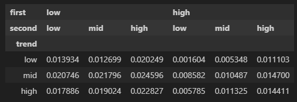

# Trend Factor in China

[Original Paper](https://papers.ssrn.com/sol3/papers.cfm?abstract_id=3402038)
> We propose a novel trend factor for the Chinese stock market, which incorporates both price and volume information to capture dominant individual trading, momentum, and liquidity. We find that volume plays a more significant role in the trend factor for China than for the US, reflecting the greater retail participation in China. By incorporating this trend factor into the 3-factor model of Liu et al. (2019), we propose a 4-factor model that explains a wide range of stylized facts and 60 representative anomalies. Our study highlights the important role of individual trading in asset pricing, especially in China.

前后大概肝了1周实现了大部分逻辑，算是比较好的练手，也可以复用。

# Data

## feature 

- close price : MA10 , MA400
    - scaled by the price at $t$ to make it stationary 
- volume : MA10 , MA400
    - RMB amount in fact
    - scaled by the amount at $t$ to make it stationary 
- finacial data: size, ep
    - 要注意大部分的财务数据源存在数据重复问题，只能用最近一次发布的当期财务指标来避免lookahead

Need align to month, and avoid lookahead bias.

## target

- return : return in $t+1$ month

# ERTrend factor

- 使用上面的数据滚动训练LR
- 每个月都能获得一组参数 $\beta$ 
- 使用超参 $\lambda$ 对$\beta$ 做EMA，超参优化逻辑是计算使收益最大化的值
    - 原文中没有写优化超参的portfolio如何构造，只说构造了100组(对应$\lambda$ 值的trend portfolios）, 选择使sharpe ratio 最大的$\lambda$ . 有可能是进行了分组，计算high 部分的收益？可是说不太通
    - 原文给出前6个月在0.01~0.02 震荡，然后收敛到0.01 ，为了简单直接用0.01
- 使用EMA平滑的$\beta$ 带入模型输出就是ERTrend

## 2 × 3 × 3 cross-section regression

As a result, the intersections of those groups produce 18 (2 × 3 × 3) Size-EP-Trend portfolios, among which there are 9 portfolios in the Size-Small (Size-Big) group, 6 portfolios in the EP-Low (EP-Mid and EP-High) group, and 6 portfolios in the Trend-Low (Trend-Mid and Trend-High) group

每月计算一次ERTrend 然后分组后计算收益，可以肯定避免了lookahead bias.

## Evaluation

### EMA平滑后参数表现效果并不好于原参数:

- 可能是因为我没有对在startup 对$\lambda$ 进行优化，导致前期预测不理想，后期可以看到基本重合

### 每个分组的回测详细结果

- 我的实验(时间长度与原文一致)

- 我的实验(延长到2023年9月)

与原文不同，(low,high,mid) 这个分组出现了最高的年化收益。

不一致原因分析：
1. $\lambda$ 没使用原文的优化逻辑
2. 计算的是均仓买入的收益，原文中是value-weighted (VW) returns（按照市值的比例来购买股票），我使用vm return 计算的回报比均仓低不少。
3. 原文的size 分组使用的是A+B+H股总市值，我只使用了A股的市值。
4. 没有包含退市股票
5. 原文的warmup可能和我不一致，原文使用38个月数据warmup $\beta$ 然后在2005年开始测试，我的逻辑类似但是细节实现估计不同。
6. 财务数据源中的季度扣非净利润的数据可能不一致，我从tushare获取并经过处理，原文作者是从wind获取的。

### 每个分组的月平均return

- 原文(红框部分)

- 我的实验(时间长度与原文一致)

- 我的实验(延长到2023年9月)

可以看到 low,high,mid 月收益是最高的。 Trend-High 部分都少了1个点左右，可能是因为前述的一些原因。

### (low,high,high) 分组的积累收益和年化收益率

- 积累收益和年化收益率

可以看到2023年虽然整体表现不好，但是这个收益率却是不错的。

- 交易股票数量

需要警惕的是投资组合较多，资金需求量可能较大。
且可能有一些股票的流动性不足以买入足够数量。

## TODO

- 使用其他指标分组
- 更细粒度的分组
- 增加分组或者过滤条件（过滤st，低流动性等）

--------------

## week级别迭代

发现low,high,low 的收益要月高于其他的策略，这代表了短期趋势trend更可能反转

- 包含st

- 不不包含st

------

## 更细粒度的分组

size, ep, ertrend 按5等分分组，使用vwap 作为价格计算ma10和ma400 以及回测数据

### 月换手

这样就比较明显，小市值 大ep  大ertrend 的回报较高

### 周换手

能看到周趋势也是反转的
